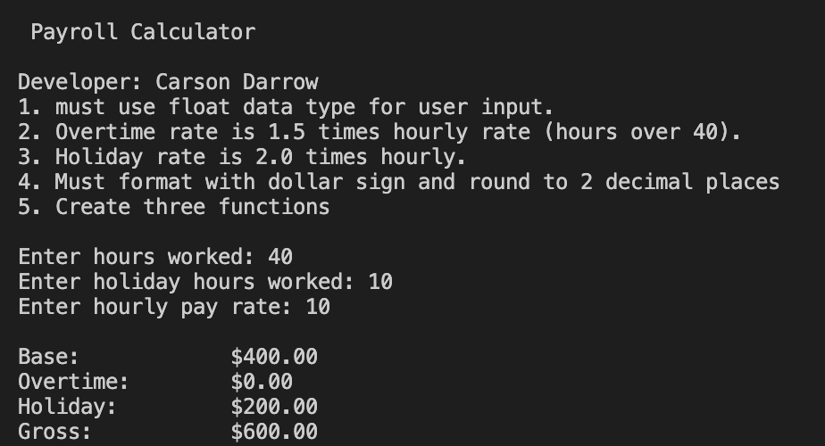
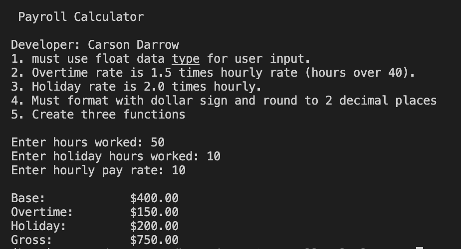
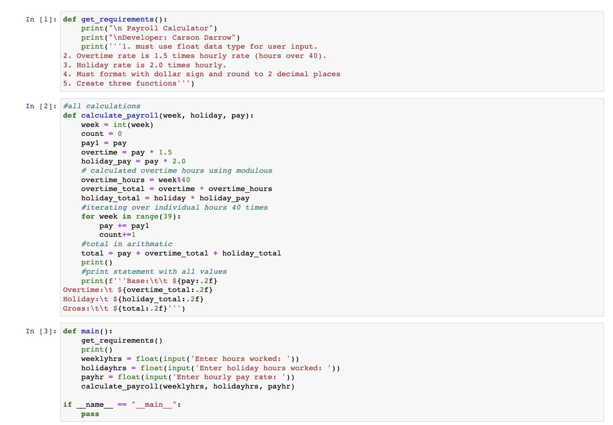
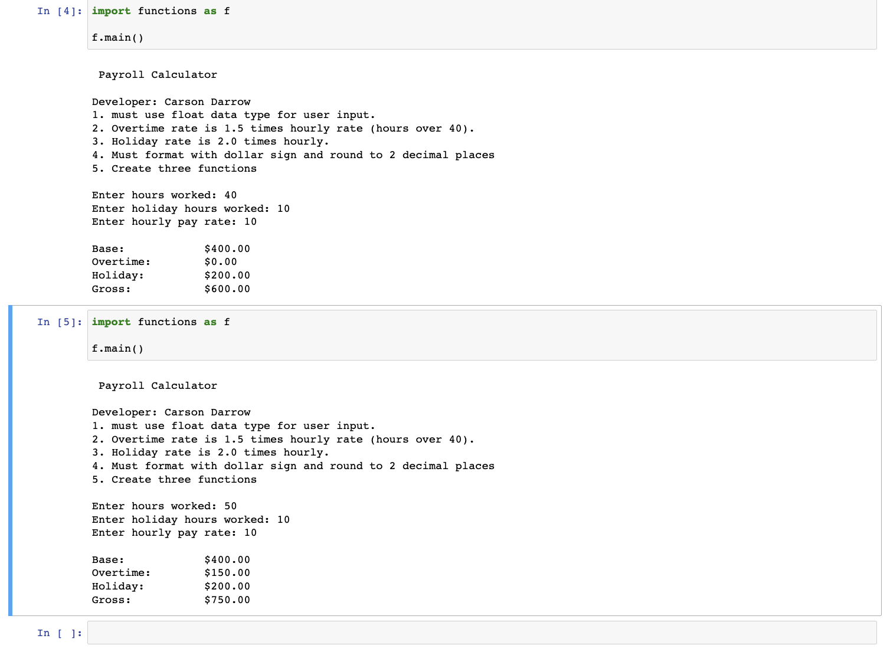
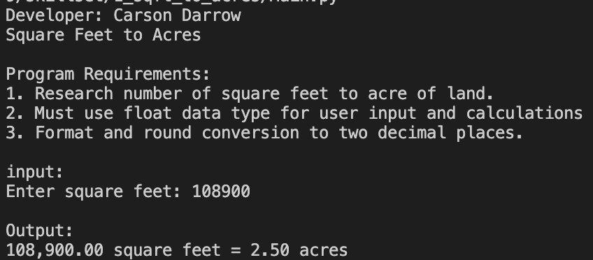
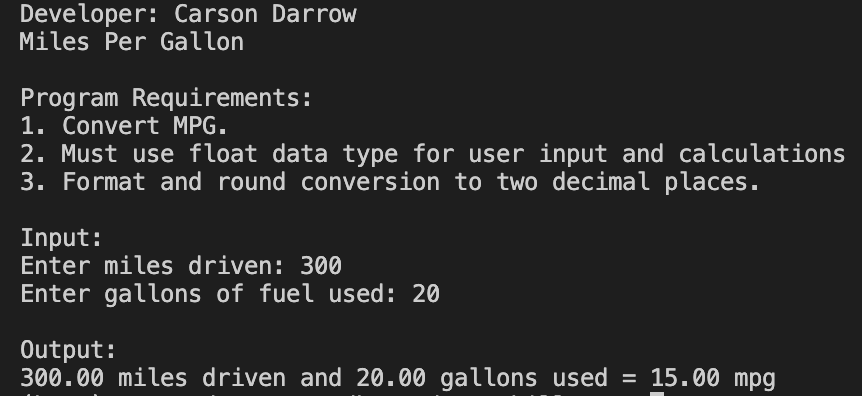
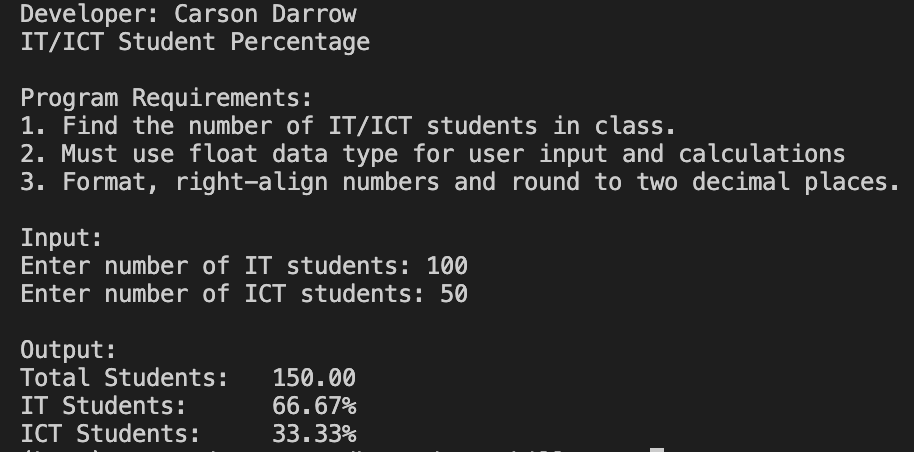

> **NOTE:** This README.md file should be placed at the **root of each of your repos directories.**
>
>Also, this file **must** use Markdown syntax, and provide project documentation as per below--otherwise, points **will** be deducted.
>

# LIs4369

## Carson Darrow

### Assignment 2 Requirements:

Three Parts:

1. Backward Engineer python program 
2. Upload A2 ipynb file with working link
3. Chapter Questions (Chs 3 4)

#### README.md file should include the following items:

* Course title, your name, assignment requirements, as per A1
* Link to A1 ipynb file [payroll_calc.ipynb](a2_payroll_calculator/payroll_calc.ipynb)
* Screenshot of Payroll Calculator in Visual Studio Code
* Screenshot of Payroll Calculator in JuoyterNotebook 
* Bitbucket repo links

> This is a blockquote.
> 
> This is the second paragraph in the blockquote.
>

#### Assignment Screenshots:

| Screenshot of Payroll Calculator No Overtime (VS Code) | Screenshot of Payroll Calculator Overtime (VS Code) |
| -------------- | --------------|
|  |  |

| Screenshot of Payroll Calculator 1 (JupyterNotebook) | Screenshot of Payroll Calculator 2 |
| -------------- | --------------|
|  |  |

### Skillset #1 - #3:

| Skillset #1 | Skillset #2 | Skillset #3 |
| -------------- | --------------| -------------- |
|  |  |  |

#### Tutorial Links:

*Bitbucket Tutorial - Station Locations:*
[A1 Bitbucket Station Locations Tutorial Link](https://bitbucket.org/cbd19a/bitbucketstationlocations/ "Bitbucket Station Locations")

*Tutorial: Request to update a teammate's repository:*
[A1 My Team Quotes Tutorial Link](https://bitbucket.org/username/myteamquotes/ "My Team Quotes Tutorial")