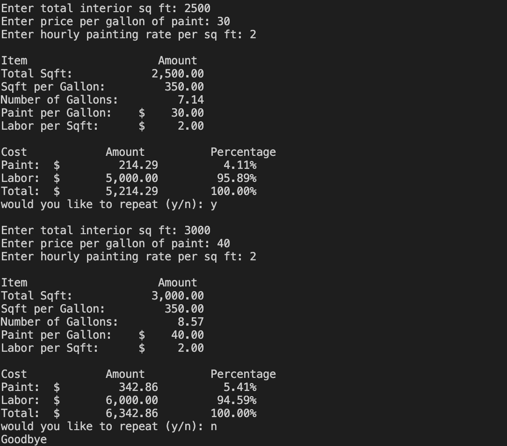
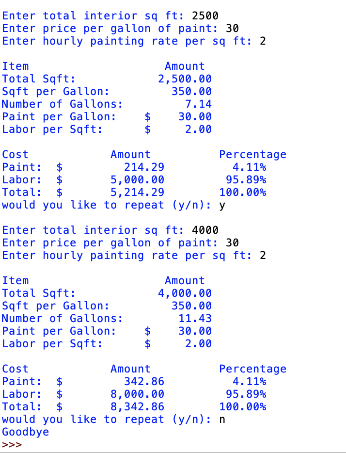
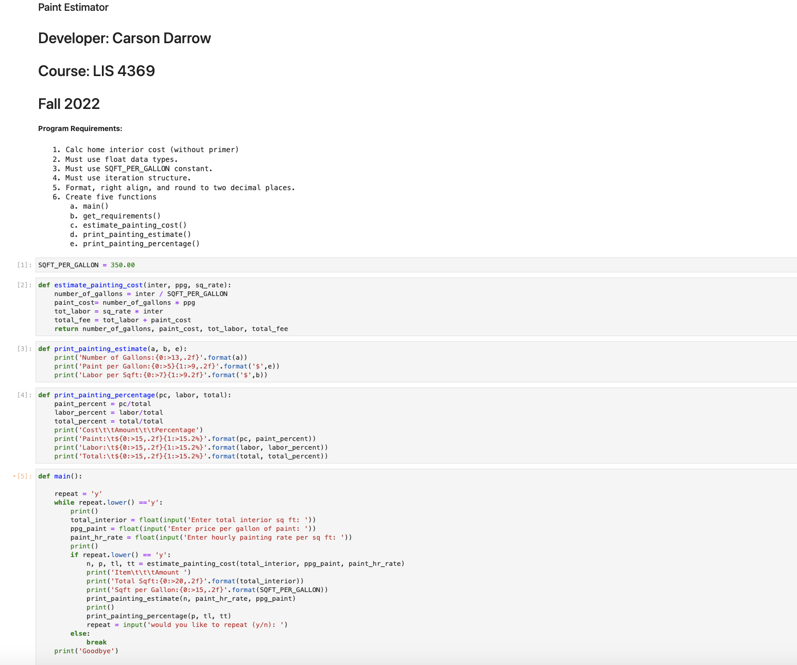
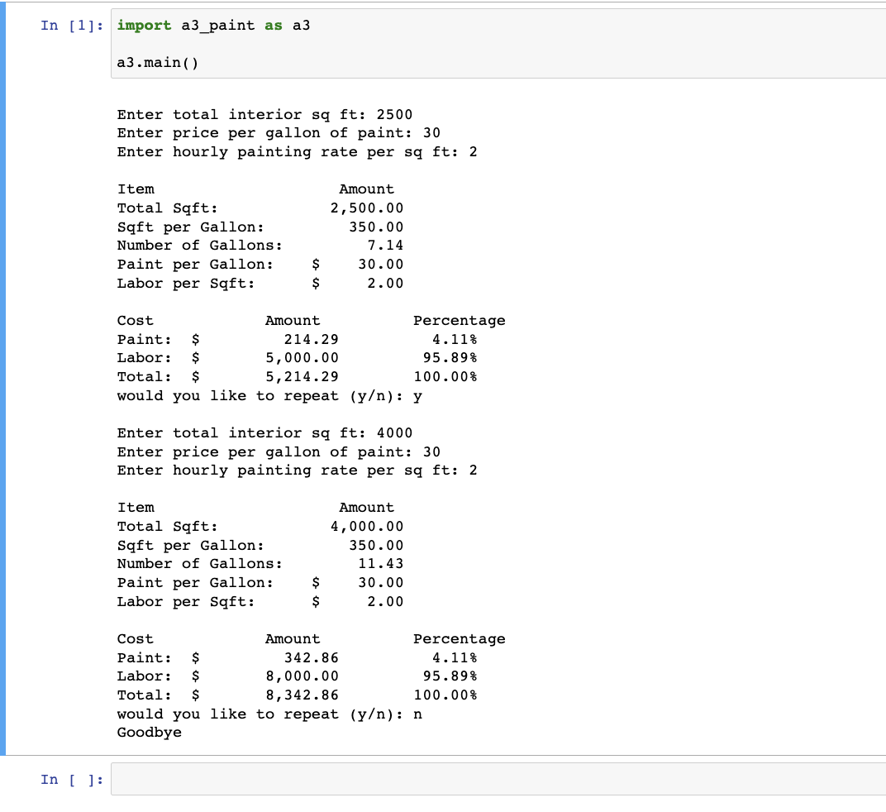
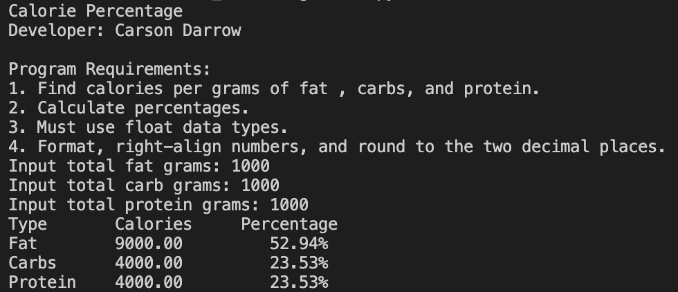
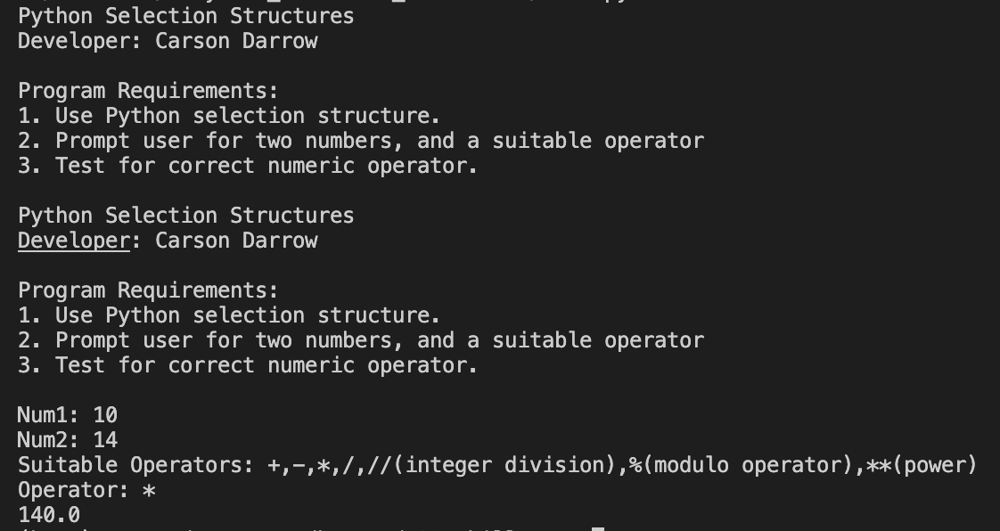
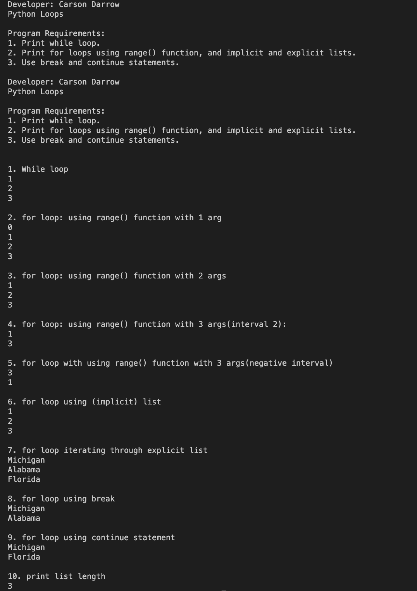

> **NOTE:** This README.md file should be placed at the **root of each of your repos directories.**
>
>Also, this file **must** use Markdown syntax, and provide project documentation as per below--otherwise, points **will** be deducted.
>

# LIS4369

## Carson Darrow

### Assignment 4 Requirements:

Three Parts:

1. Assignment requirements, as per A4.
2. Screenshots as per examples below, including graph.
3. Chapter Questions (Chs 5-6)

#### README.md file should include the following items:

* Course title, your name, assignment requirements, as per A1
* Link to A4 ipynb file [a4.ipynb](a4.ipynb)
* Restart & Clear Output
* Restart & Run All
* Bitbucket repo links

> This is a blockquote.
> 
> This is the second paragraph in the blockquote.
>

#### Assignment Screenshots:

| Screenshot of Paint Estimator (VS Code) | Paint Estimator(IDLE) | 
| -------------- | --------------|
|  |  |

| Screenshot of Paint Estimator 1 (JupyterNotebook) | Screenshot of Paint Estimator 2 |
| -------------- | --------------|
|  |  |

### Skillset #4 - #6:

Skillset #4

 

| Skillset #5 | Skillset #6 |
| -------------- | --------------|
|  |  |

#### Tutorial Links:

*Bitbucket Tutorial - Station Locations:*
[A1 Bitbucket Station Locations Tutorial Link](https://bitbucket.org/cbd19a/bitbucketstationlocations/ "Bitbucket Station Locations")

*Tutorial: Request to update a teammate's repository:*
[A1 My Team Quotes Tutorial Link](https://bitbucket.org/username/myteamquotes/ "My Team Quotes Tutorial")

