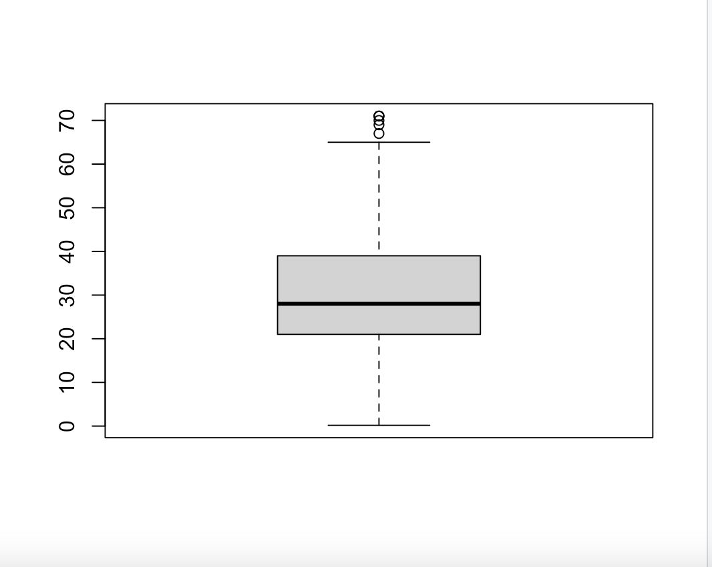
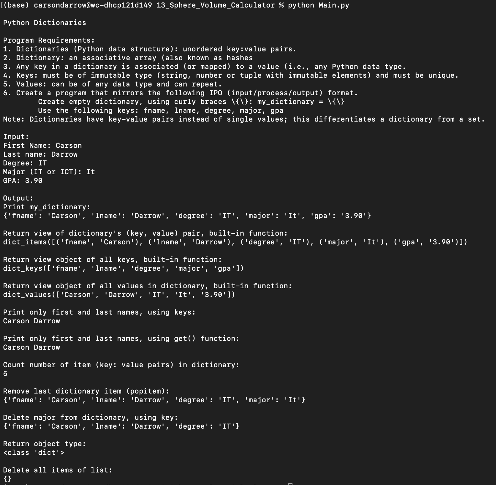

> **NOTE:** This README.md file should be placed at the **root of each of your repos directories.**
>
>Also, this file **must** use Markdown syntax, and provide project documentation as per below--otherwise, points **will** be deducted.
>

# LIS4369

## Carson Darrow

### Assignment 5 Requirements:

Three Parts:

1. Note all functions/commands from tutorial
2. Take screenshots of Rstudio and accompanying charts
3. Skillset 13-15

#### README.md file should include the following items:

* Screenshots of environement
* Screenshots of accompanying charts

> This is a blockquote.
> 
> This is the second paragraph in the blockquote.
>

## Assignment Screenshots :

| Screenshot of Learning RStudio Part 1: | 
| -------------- | 
|  | 

| Screenshot of Learning RStudio Part 2: | Screenshot of Learning RStudio Part 3: | Screenshot of Learning RStudio Part 4: |
| -------------- | -------------- | -------------- |
|  |  |  | 

### Video of A5 RStudio

| Screenshot of Learning RStudio Part 2: | Screenshot of Learning RStudio Part 3: | Screenshot of Learning RStudio Part 4: |
| -------------- | -------------- | -------------- |
|  |  |  |

| Screenshot of Learning RStudio Part 3: | Screenshot of Learning RStudio Part 4: |
|-------------- | -------------- |
|  |  | 

### Skillset #13 - #15:

| Skillset #13 |
| -------------- |
|  |

| Skillset #14 |
| -------------- |
|  | 

| Skillset #15 |
| -------------- |
|  |

#### Tutorial Links:

*Bitbucket Tutorial - Station Locations:*
[A1 Bitbucket Station Locations Tutorial Link](https://bitbucket.org/cbd19a/bitbucketstationlocations/ "Bitbucket Station Locations")

*Tutorial: Request to update a teammate's repository:*
[A1 My Team Quotes Tutorial Link](https://bitbucket.org/username/myteamquotes/ "My Team Quotes Tutorial")

