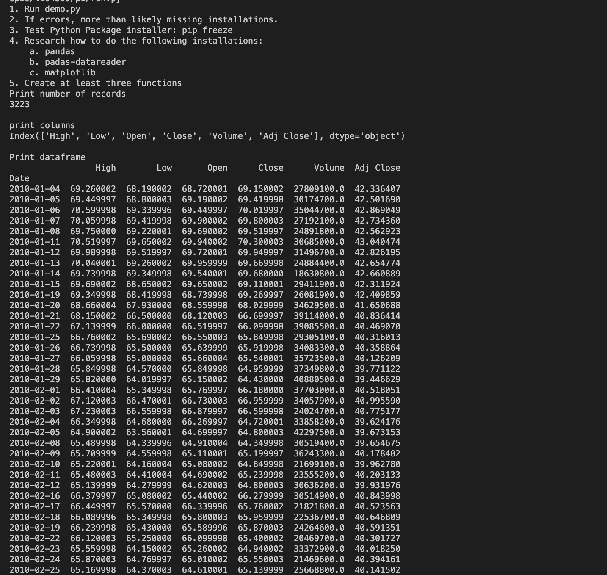
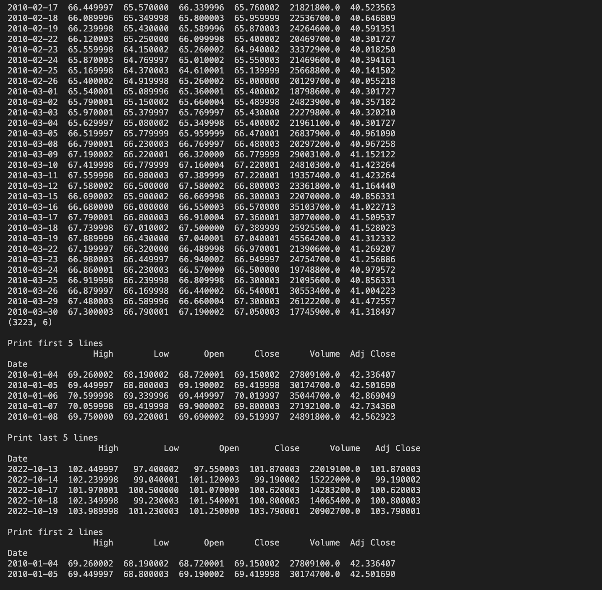
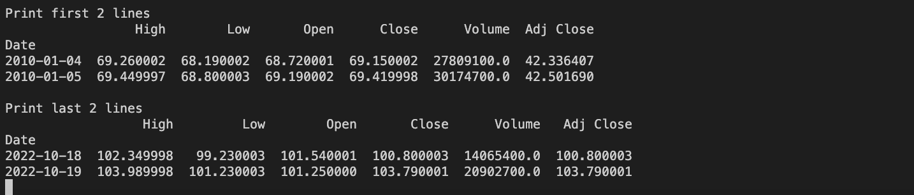
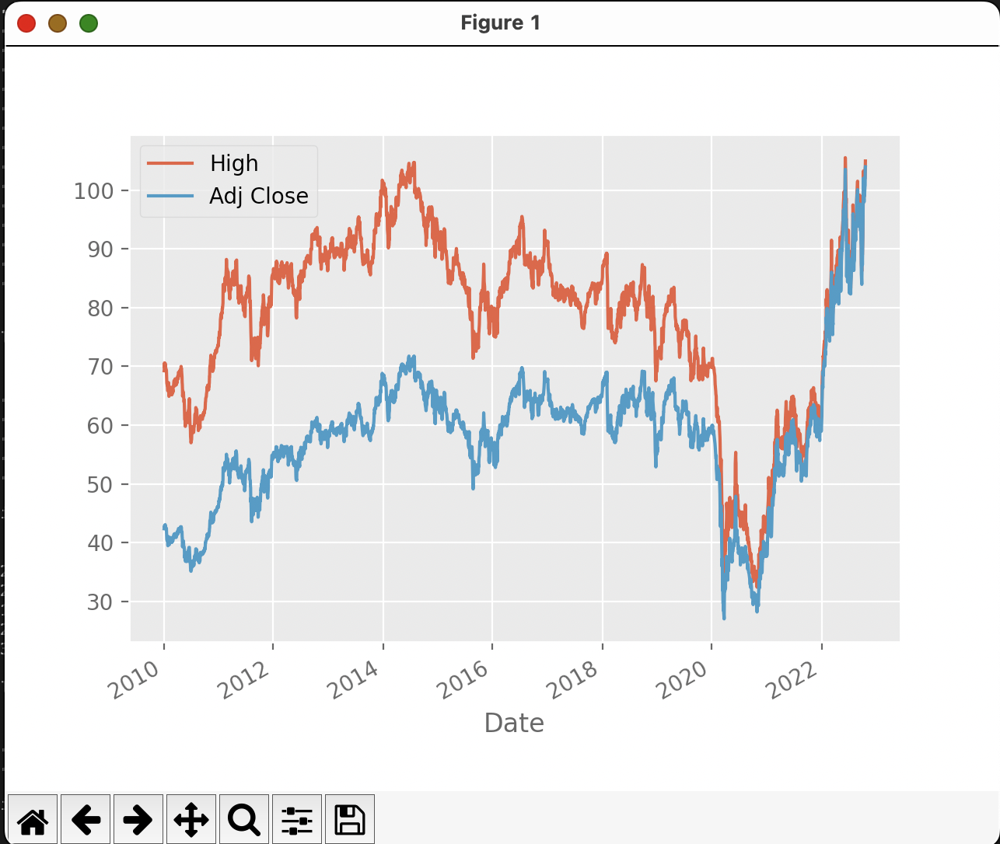
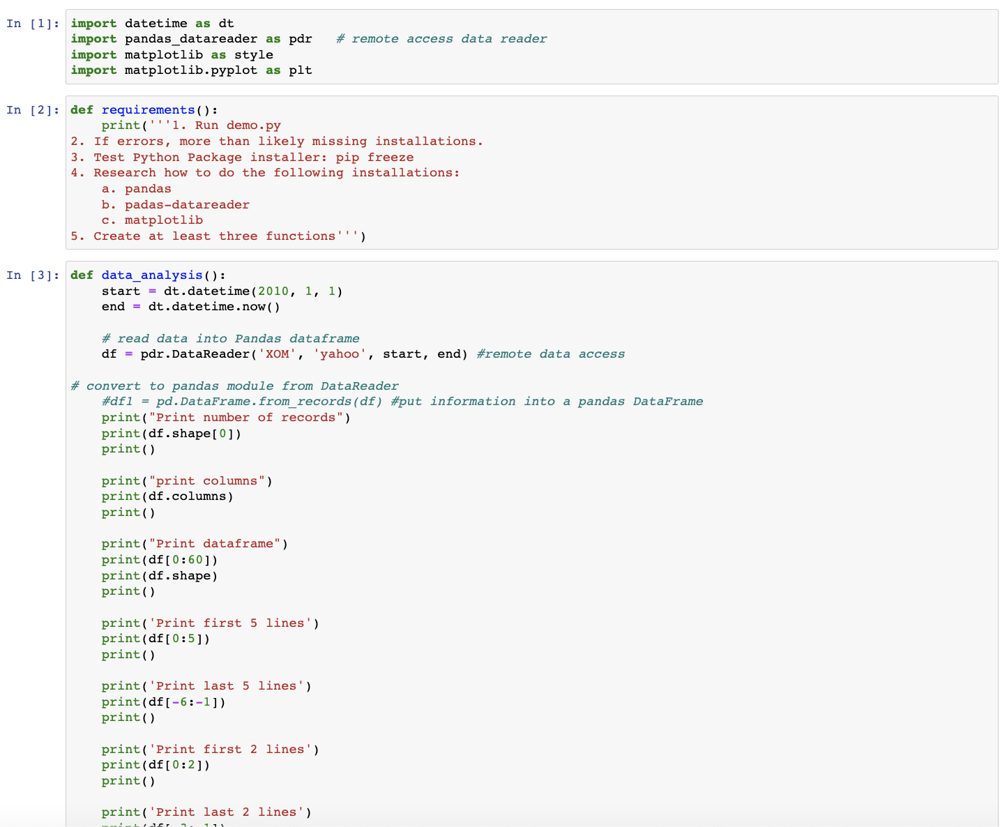
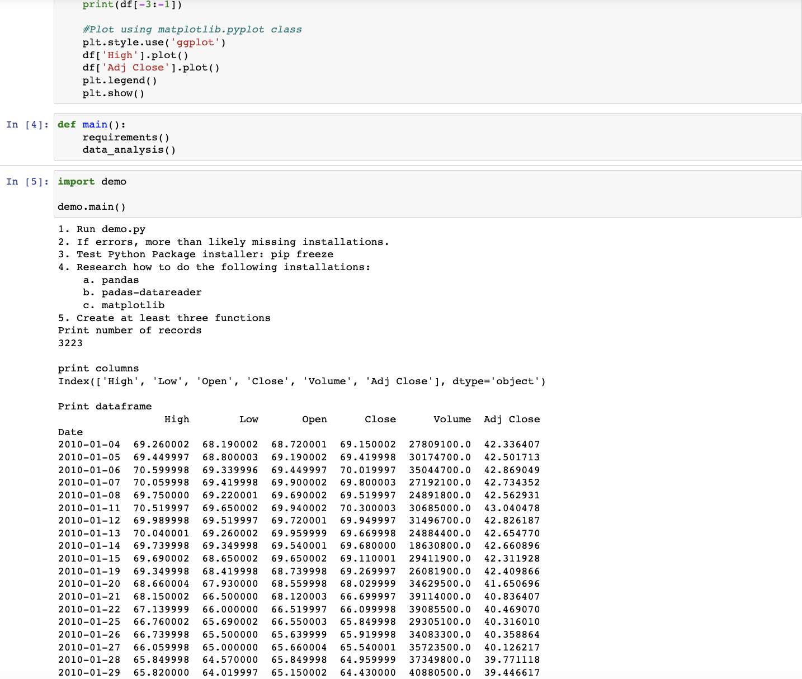
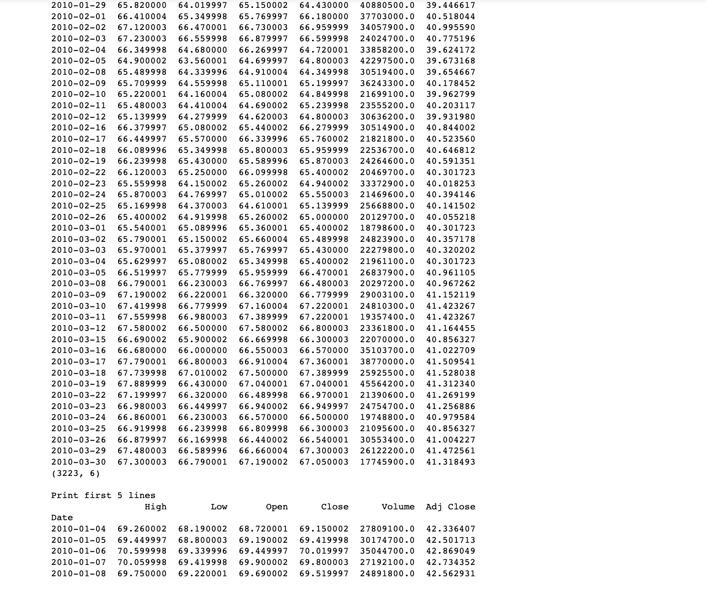
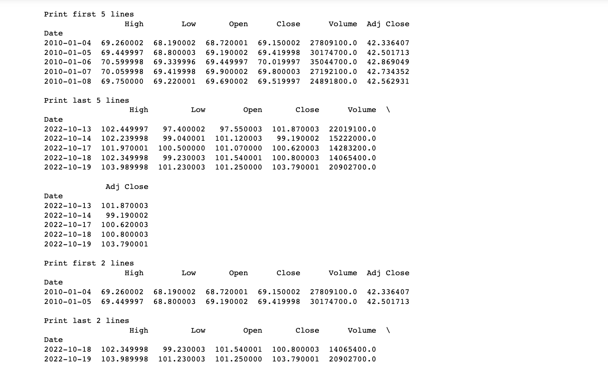
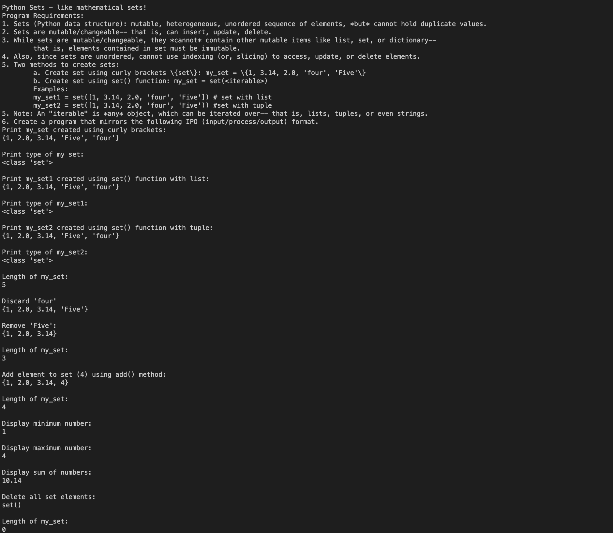

> **NOTE:** This README.md file should be placed at the **root of each of your repos directories.**
>
>Also, this file **must** use Markdown syntax, and provide project documentation as per below--otherwise, points **will** be deducted.
>

# LIS4369

## Carson Darrow 

### Assignment  Requirements:

Three Parts:

1. Assignment requirements, as per P1.
2. Screenshots as per examples below.
3. Upload P1 ipynb file [project1.ipynb](img/project1.ipynb) and create link in README.md; Note: Before uploading .ipynbfile, be sure to do the following actions from Kernal menu:
	* Restart & Clear Output
	* Restart & Run All
	
	
#### README.md file should include the following items:

* Course title, Name, Assignment Requirements
* Screenshot of running application’s first user interface
* Screenshot of running application’s second user interface

> This is a blockquote.
> 
> This is the second paragraph in the blockquote.

#### Assignment Screenshots:

**Screenshot of Project 1 (VS Code)**

| Screenshot of Project 1 (IDLE) | Screenshot of Project 1 (IDLE) |
| -------------- | --------------|
|  | 

**Screenshot of Project 1 (Jupyter Notebook)**

### Screenshot of Skillsets:

| Skillset 7 | Skillset 8 |
| -------------- | --------------|
|  |  | 

*Skillset 9*

 

