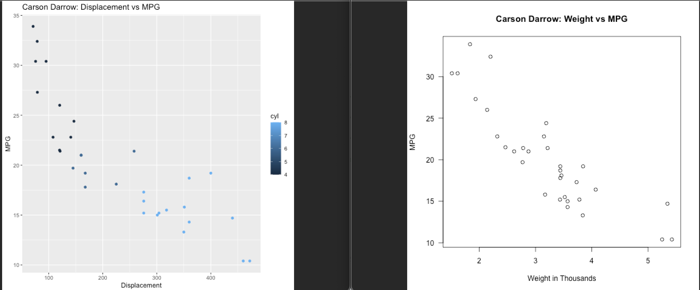
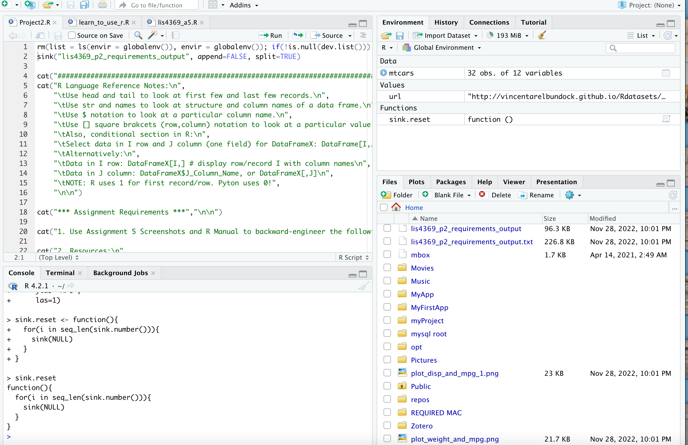

> **NOTE:** This README.md file should be placed at the **root of each of your repos directories.**
>
>Also, this file **must** use Markdown syntax, and provide project documentation as per below--otherwise, points **will** be deducted.
>

# LIS4369

## Carson Darrow

### Project 2 Requirements:

Four Parts:

1. Use Assignment 5 screenshots and R Manual to backward-engineer the following requirements:
2. Resources:
    * R Manual: https://cran.r-project.org/doc/manuals/r-release/R-lang.pdf 
    * R for Data Science: https://r4ds.had.co.nz/
3. Use Motor Trend Car Road Tests data:
    * Research the data!  https://stat.ethz.ch/R-manual/R-devel/library/datasets/html/mtcars.html 
    * url = "http://vincentarelbundock.github.io/Rdatasets/csv/datasets/mtcars.csv"

#### README.md file should include the following items:

* Course title, Your name, Assignment Requirements
* Screenshot of Graph Plot
* Screenshot of RStudio Pannel

> This is a blockquote.
> 
> This is the second paragraph in the blockquote.

#### Assignment Screenshots:

### Plot Graphs

### RStudio Pannel

### Links to R Files

 [project2.R](project2.R)
[R Output](lis4369_p2_requirements_output.txt)

#### Tutorial Links:

*Bitbucket Tutorial - Station Locations:*
[A1 Bitbucket Station Locations Tutorial Link](https://bitbucket.org/cbd19a/bitbucketstationlocations/ "Bitbucket Station Locations")

*Tutorial: Request to update a teammate's repository:*
[A1 My Team Quotes Tutorial Link](https://bitbucket.org/username/myteamquotes/ "My Team Quotes Tutorial")

